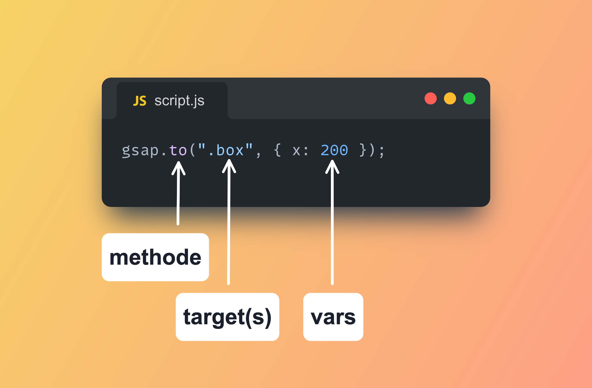

# Introduction à GSAP (GreenSock Animation Platform)

GSAP (GreenSock Animation Platform) est une bibliothèque puissante pour créer des animations complexes en JavaScript. Elle est utilisée pour animer des éléments HTML, SVG, et même des propriétés CSS avec une grande performance et compatibilité à travers les navigateurs sans avoir besoin de plugins additionnels.

### Pourquoi utiliser GSAP ?

- **Performance**: GSAP est optimisée pour fournir des animations fluides, même sur des appareils mobiles.
- **Compatibilité**: Fonctionne sur tous les navigateurs, y compris IE 11.
- **Flexibilité**: Animer presque tout ce qui a une valeur numérique.
- **Richesse des fonctionnalités**: Supporte des retards, des boucles, des rebonds, des easing et plus encore.
- **Communauté**: Une large communauté d'utilisateurs et de ressources disponibles.

## Installation de GSAP

GSAP peut être ajouté à votre projet de plusieurs manières :

- Via NPM : `npm install gsap`
- En ajoutant un script dans votre HTML :

  ```html
    <script src="https://cdn.jsdelivr.net/npm/gsap@3.12.5/dist/gsap.min.js"></script>
  ```

## Premier exemple d'animation

Créons une animation simple où un élément se déplace de 100 pixels sur l'axe X.

```html
<!DOCTYPE html>
<html lang="en">
<head>
    <meta charset="UTF-8">
    <title>GSAP Basic Animation</title>
    <style>
        .box {
            width: 100px;
            height: 100px;
            background-color: red;
            position: relative;
        }
    </style>
</head>
<body>

<div class="box"></div>

<script src="https://cdn.jsdelivr.net/npm/gsap@3.12.5/dist/gsap.min.js"></script>
<script>
  gsap.to(".box", {duration: 1, x: 100});
</script>

</body>
</html>
```

Dans cet exemple, `.box` se déplacera de 0 à 100 pixels sur l'axe X en 1 seconde.

## Concepts Clés de GSAP

- **Targets** : L'élément ou les éléments que vous souhaitez animer.
- **Duration** : La durée de l'animation.
- **Vars** : Un objet littéral contenant les propriétés que vous souhaitez animer et leurs valeurs finales.



## Animations Plus Avancées

Avec GSAP, vous pouvez créer des séquences d'animations, des animations basées sur le scroll, des animations complexes avec des callbacks, et bien plus.

### Exemple d'une séquence d'animation :

```javascript
var tl = gsap.timeline();
tl.to(".box", {duration: 1, x: 100})
  .to(".box", {duration: 1, rotation: 360});
```

## Quelques méthodes dans GSAP

**Les méthodes (Tweens)**

Il existe quatre types d'interpolations (tweens) :

`gsap.to()` - C'est le type d'interpolation le plus courant. Une interpolation `.to()` commence par l'état actuel de l'élément et **anime "vers" les valeurs définies dans l'interpolation.**

`gsap.from()` - Comme une interpolation `.to()` inversée, où elle **anime "à partir" des valeurs définies dans l'interpolation** et se termine par l'état actuel de l'élément.

`gsap.fromTo()` - **Vous définissez _à la fois_ les valeurs de départ _et_ d'arrivée.**

`gsap.set()` **Définit immédiatement les propriétés** (sans animation). C'est essentiellement une interpolation `.to()` de durée zéro.

## Animation de Propriétés CSS

Avec GSAP, vous pouvez animer presque toutes les propriétés CSS, des plus simples comme `opacity` et `color`, aux transformations plus complexes comme `scale` et `rotate`. Voici quelques exemples :

### Animer la Taille et la Couleur

```javascript
gsap.to(".element", {duration: 2, width: "100%", backgroundColor: "#ff0000"});
```

Cette animation change la largeur de l'élément à 100% et sa couleur de fond en rouge sur une durée de 2 secondes.

### Animer les Transformations

```javascript
gsap.to(".element", {duration: 1, scale: 1.5, rotation: 360});
```

Ici, l'élément est agrandi 1.5 fois sa taille et tourné de 360 degrés.

## Utilisation des Délais, Facilités et Callbacks

- **Délais (Delay)**: Vous pouvez retarder le début d'une animation en utilisant la propriété `delay`.

```javascript
gsap.to(".element", {duration: 2, x: 100, delay: 1});
```

- **Facilités (Ease)**: Les facilités permettent de modifier la vitesse d'une animation au fil du temps, rendant les mouvements plus naturels.

```javascript
gsap.to(".element", {duration: 2, x: 100, ease: "elastic.out"});
```

- **Callbacks**: GSAP permet d'exécuter des fonctions à différents moments de l'animation, comme `onStart`, `onUpdate`, et `onComplete`.

```javascript
gsap.to(".element", {duration: 1, x: 100, onComplete: () => console.log("Animation complète!")});
```